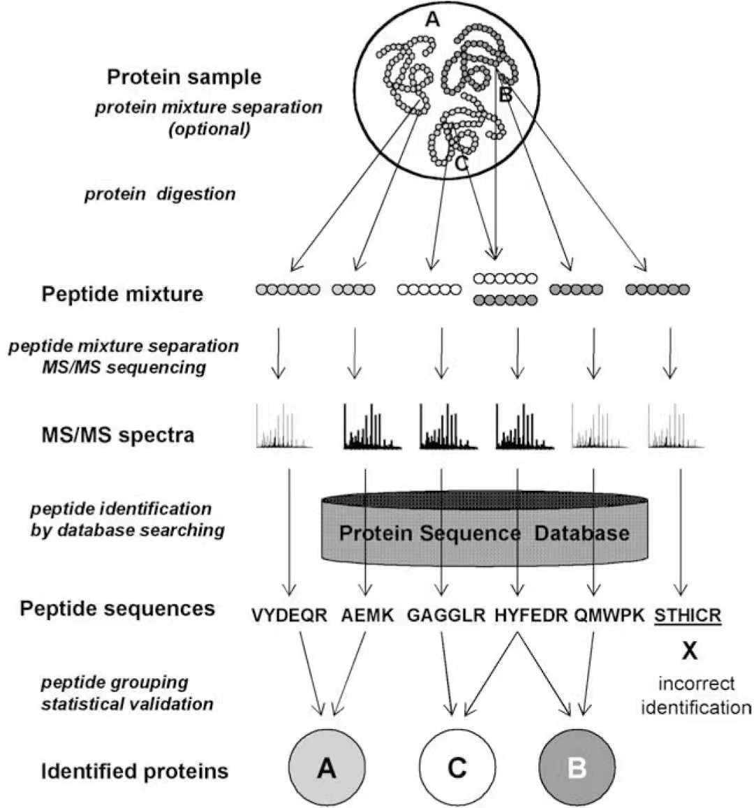

[🏠HOME](README.md)

# Learning Materials about Proteomics

> Outline

[蛋白质组学研究方法概述（上）](https://www.jianshu.com/p/36d5a7afa4de)
[蛋白质组学研究方法概述（下）](https://www.jianshu.com/p/de5f5a43cc3b)
<imgsrc="src/ms_workflow.jpg" alt="workflow pic" width=100 />

> Theory & Usage

[蛋白质谱的原理及使用（1）](https://www.jianshu.com/p/272c7814f593)
[蛋白质谱的原理及使用（2）](https://www.jianshu.com/p/825fd05a0d12)
[蛋白质谱的原理及使用（3）](https://www.jianshu.com/p/ef11012d5e30)
[蛋白质谱的原理及使用（4）](https://www.jianshu.com/p/7e2149715b39)

> Data Analysis

[蛋白质组学数据分析基础（1）](https://www.jianshu.com/p/791329337af7)
[蛋白质组学数据分析基础（2）](https://www.jianshu.com/p/872d7436bc64)
[蛋白质组学数据分析基础（3）](https://www.jianshu.com/p/492bbb5a90d5)

---
