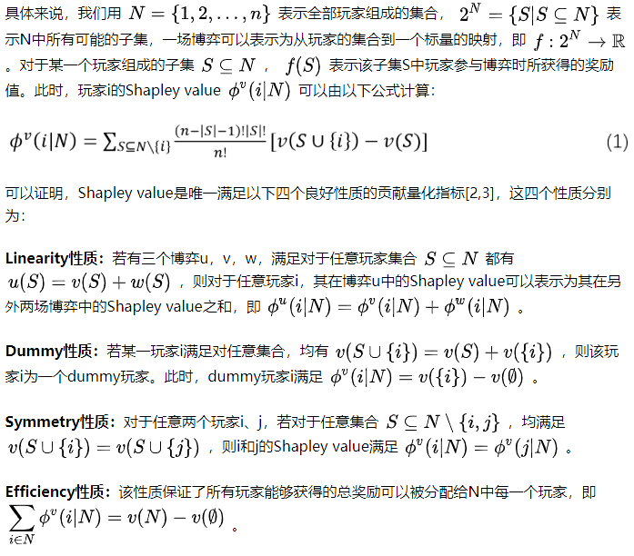
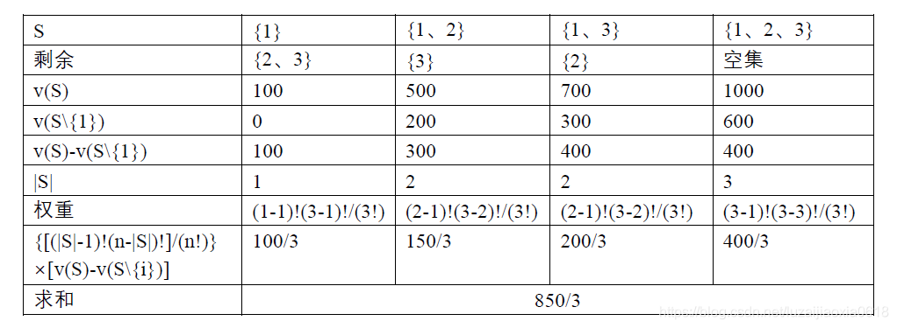

[🏠HOME](README.md)

# Shapley Value

---

Shapley value最初在博弈论领域被Shapley提出。让我们考虑一场由多个玩家共同参与的博弈，当参与博弈的玩家不同，所获得的奖励也有所不同，部分玩家在这场博弈中会有较大的贡献，而部分玩家则贡献较小。Shapley value是一个能够根据不同玩家的贡献，将总的奖励公平地分配给每个玩家的度量指标。其中，成员i参与不同联盟S为自身参与联盟创造得边际贡献记为 [v(S)-v(S\{i})]。

## 例子

共有三家公司，公司1，2，3单独投资可盈利v(1)=100，v(2)=200，v(3)=300，如果公司1和公司2联合，可获利v(1&2)=500；公司2和公司3联合，可获利v(2&3)=600；公司1和公司3联合，可获利v(1&3)=700；公司1、公司2和公司3联合，可获利v(1&2&3)=1000；那么三个公司一起合作，每个公司应各获利多少？

### 成员1的获利：

共有3个成员，n=3

成员1 可以组成的联盟有4种情况：{1}, {1, 2}, {1, 3}, {1, 2, 3}

Shapley值法的核心思想在于按照成员对联盟的边际贡献率进行利益分配。
