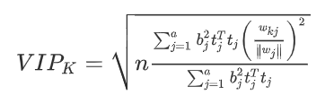

[🏠HOME](README.md)

# The VIP Algorithm

---

The variable importance in projection (VIP) for a particular indicator is calculated using the regression coefficient b, weight vector wj, and score vector tj. where wkj is the k th element of the weight vector wj. PLS-VIP is used to identify the importance of each indicator in affecting the aggregate index.



[Ref](https://www.sciencedirect.com/topics/engineering/variable-importance-in-projection)

```python
def vip(model):
    import numpy as np
    t = model.x_scores_
    w = model.x_weights_
    q = model.y_loadings_
    p, h = w.shape
    vips = np.zeros((p,))
    s = np.diag(t.T @ t @ q.T @ q).reshape(h, -1)
    total_s = np.sum(s)
    for i in range(p):
        weight = np.array([ (w[i,j] / np.linalg.norm(w[:,j]))**2 for j in range(h) ])
        vips[i] = np.sqrt(p*(s.T @ weight)/total_s)
    return vips
# Where model could be a pls instance from sklearn.
```
