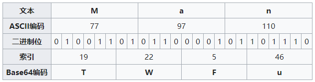

[🏠HOME](README.md)

# 卦爻编码

---

**易经**共六十四卦，由乾、坤、震、巽、坎、离、兑、艮共八卦两两组合而成，每卦分三爻。爻分两种，阳爻(―)、阴爻（--）。

> ☯八卦: ☰乾 ☱兌 ☲離 ☳震 ☴巽 ☵坎 ☶艮 ☷坤

**Base64**是一种基于64个可打印字符来表示二进制数据的表示方法。如，可将3个字节编码为4个字符（3 × 8 = 4 × 6）。



其实，数学家莱布尼茨早在17世纪就注意到《周易》的二进制属性。

`易经`和`Base64`在构造上很相似，64个元素是可以对应起来的，这就在编码和解码的时候提供了另一种玩法。


```JavaScript
// base64
encode: {
    btoa('NOTHING IS PERFECT')
};
// "Tk9USElORyBJUyBQRVJGRUNU"

decode: {
    atob("Tk9USElORyBJUyBQRVJGRUNU")
};
// "NOTHING IS PERFECT"
```

+ 记录至此，以便日后查阅。
